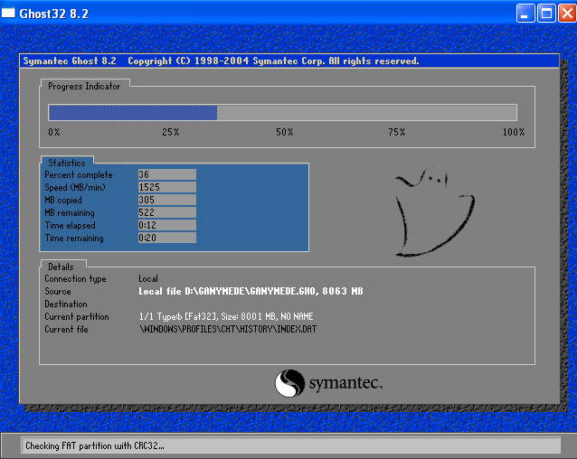

# [Docker][1]和[DaoCloud][2]纯小白入门手册

> 一天，乔布斯走进了拉里.凯尼恩(Larry Kenyan)的办公隔间，他是负责麦金塔电脑操作系统的工程师，乔布斯抱怨说开机启动时间太长了。凯尼恩开始解释，但乔布斯打断了他。他问道：“如果能救人一命的话，你愿意想办法让启动时间缩短10秒钟吗？”凯尼恩说也许可以。乔布斯于是走到一块白板前开始演示，如果有500万人使用Mac，而每天开机都要多用10秒钟，那加起来每年就要浪费大约3亿分钟，而3亿分钟相当于至少100个人的终身寿命。“这番话让拉里十分震惊，几周过后，乔布斯再来看的时候，启动时间缩短了28秒，”阿特金森回忆说，“史蒂夫能看到宏观层面，从而激励别人工作。” 

> 引述自：《史蒂夫·乔布斯传》p.111

乔布斯对时间的理解，促使我也有了写这篇文章的动力。因为：[Docker][1]和[DaoCloud][2]是划时代的伟大工具。web程序开发者、测试员、系统管理员们利用它们能够节约巨量的时间，加快产品上线进而也能节省用户（你、我、每个人）的时间。然而，居然没有一篇为纯粹只懂得个人电脑的小白所写的入门手册以至于这么优秀的工具无法迅速普及从而拯救N个人的生命，这简直太令人发指！

工具的产生是为了解决问题，那么先来看看世界上存在着什么样的问题需要Docker和DaoCloud来解决。

## 原始时代

回忆一下Windows 98年代使用广泛的Norton Ghost软件（现在属于Symantec公司）。Ghost软件的作用是对可运行的系统环境做clone（克隆），形成一个镜像（image），以便Windows 98崩溃以后能够从镜像中迅速恢复一个可用的系统环境。这解决了频繁重装Windows 98的麻烦，而且从镜像恢复比安装更节约时间。它有几种常见用法：

- 操作系统（例如Windows 98）安装好以后，对C盘（系统盘）做一个clone；
- 装完操作系统后再装些软件（例如输入法），然后对系统盘做clone（假设输入法也装在系统盘里）；
- 或者装完操作系统，再装完软件（比如photoshop），然后对photoshop做一些自己习惯的配置，最后再clone。

显然，将更多的手工工作clone到image里，更能够节约多次安装的时间和人工劳动。

Docker对这个模式进行了Linux和网络世界的完美实现，但是以一种更网络化的方式实现，更加节省时间和更加灵活。接着来看没有Docker以前在Linux和网络世界会遇到什么情况：

我们都知道网络上运行着很多服务器，有web服务器，有DNS服务器等等。如果我们需要自己建一个服务器，要经过许多步骤，就拿最常见的web服务器来做个说明：

1. 先要有服务器。服务器外形与我们家用的电脑（台式机和笔记本）不一样，但是里面的硬件是一样的——CPU、内存、主板、硬盘。只不过作为服务千万人的服务器，这些硬件性能比家用电脑好很多。或者，也可以用虚拟机，甚至是从云服务商那里买VPS（Virutual Private Server，云服务商提供的存在于网上的虚拟机）。
2. 安装操作系统（Linux或Windows Server版）；
3. 安装web服务器软件（Apache、Nginx等）；
4. 安装动态Web所需要的语言环境（PHP，Ruby，Python等）和数据库（MySQL等）；
5. 有时为了快速开发还需要安装一些框架（比如Python的django等）；
6. 部署代码到web服务器软件指定目录下，有时我们需要代码的版本控制系统（Subversion、Git等），这个系统可以直接安装在服务器上（通常情况，对外提供服务的正式服务器——谓之“生产环境”是不能够装版本控制系统的，但是用来做开发用途的服务器——谓之“开发环境”可以这么干）；
7. 安装配置后，还需要配置公网IP地址，买好域名并将www.域名.com指向这个IP。

累吗？很累！但是还没完！

系统管理员都知道，相同软件环境的服务器有时候要部署很多台，比如为了负载均衡，要部署一堆同样的web服务器，用户点网页的时候可以由不同服务器提供服务，以便响应海量用户。

开发者都知道，他们需要有很多台不同配置的服务器，原因在于，如果只有一个开发环境，一个项目使用python 2.7，另一个使用python 3.0，那需要进行一番设置。最头疼的是，这些软件环境升级还好说，如果需要降级就很麻烦，各种依赖库版本各种打架。因此，通常开发者都要求为不同的项目配备符合本项目软件环境要求的开发服务器，这就带来了大量不同软件环境服务器安装的需求。

有的时候，性能也出来捣乱，比如自己写的程序在配备了酷睿1代CPU的开发环境上运行的很吃力，想换到配备了酷睿5代CPU的机器，但是酷睿5代机器却没有同样的操作系统和软件环境，怎么办？只能在它上面按照旧机器的软件环境要求一模一样地安装一遍。这些问题弄的人头大以至于无法专心写代码，就连系统管理人员和测试人员也被折磨得疲惫不堪。

所以，三大痛点：

1. **相同软件环境的多个服务器的安装**
2. **不同软件环境服务器的安装**
3. **不同硬件环境的相同软件环境的安装**

Ghost方式解决的是第1和3类型的问题，而第3类型并没解决好（硬件驱动不同）。况且Linux体系的特性与Windows不同，因此没有类似Norton Ghost这样的软件，对于这三大痛点解决方案是：由于Linux系统有着可以网络安装的特性，操作系统和软件都放在服务器上，在安装不同软件环境的时候，使用相应的脚本来进行网络化自动安装，减少一些手工操作。以上这些，还没有涉及代码部署和把服务器连到网络上（上线）的自动化问题，这些步骤很多仍需要人工操作。

虚拟技术出现以后，使用虚拟机能够更方便一点解决第3个痛点。在硬件服务器操作系统中安装虚拟化软件（例如VMware）生成虚拟机母平台，在虚拟机母平台上产生多个虚拟机（没装操作系统的），再在这些虚拟机中安装操作系统和软件环境。如果遇到上述那个经典问题——机器性能不够，需要把开发环境迁移到性能更好的机器上去，那么只需要将虚拟机迁移到更好硬件平台的虚拟机母平台上去并给虚拟机分配更多的资源。

这个时代被我定义为“原始时代”，因为里面有大量的步骤是手工操作，类似于流水线生产还没有出现的原始手工时代。

## 解决原始时代的问题

终于，一群聪明人实在受不了天天把时间耗费在无穷无尽的安装配置中。他们发明了**Docker**来解决这些问题。[Docker][1]用**docker image**（中文叫做**Docker镜像**）来代替原始时代的镜像（或光盘），用**docker file**来取代自动安装脚本，用**docker node**来代替虚拟机母平台，用**容器**来代替虚拟机。综合了原始时代那些工具的所有的优点使得Linux和网络实现了完全自动化。

- 镜像（或光盘）==> Docker image
- 安装脚本 ==> Docker file
- 安装了虚拟机软件的服务器 ==> Docker node
- 虚拟机（未安装操作系统的）==> 容器

### Docker image与Docker file

**docker image**存储在[Docker][1]专门配置的网络仓库[Docker Hub][6]或[DaoCloud][2]这样的Docker云服务商的网络仓库中(任何人都可以建立这样的网络仓库，通过web服务发布这些镜像)。

**docker file**可以引用已经存在于网络仓库里的docker镜像，在其基础上继续定制的新docker镜像。所谓引用就是在docker file的开头写一句基于哪个镜像（语法是：`FROM 镜像库/镜像名`）。想让多少工序自动化，就将多少工序的相应命令写在docker file里。若将安装配置操作系统、软件的全部过程甚至代码部署都写在docker file中，那么，只需要更新代码，就实现了web应用的自动上线，从而节省大量的时间以及人工重复性工作。

执行docker file生成新docker image的操作，叫做**“构建”**。整个构建过程可以想象成模拟clone：将源docker image运行起来，按照docker file里的命令安装一些软件或者做一些配置，这一切做完以后，将整个环境制作成一个新docker image。

实际上源image并不运行，只是在docker file里写一些对其的操作，这些操作语句将被包含在新docker镜像里**（新docker镜像=源docker镜像+docker file）**，新docker镜像*运行*的时候才会执行docker file中的命令。

若一个更新的docker file引用了这个"新docker镜像"，构建的实质是将更新的docker file里的操作命令与"新docker镜像"中包含的docker file命令合并，并添加到那个更新的docker镜像里。所以，构建的本质是脚本安装，却表现为clone。

Docker术语体系中，每执行一条docker file里的命令，叫做增加一个**“层”**，无论这个“层”干的活是安装还是删除。由于镜像具有不可直接修改的性质，如果想从源docker镜像里删除某些软件后形成新的docker镜像，那么就在docker file里写入删除那些软件的语句，新构建生成的docker 镜像*运行起来*就没有那些软件了。由前述构建的实质可知：新docker 镜像本身不比源docker镜像小。

引用带来的好处是减少制作新docker镜像所需要写在docker file里的命令。举个例子：源镜像是Linux操作系统，那么可以引用它并制作出一个含有Linux+Apache+PHP的docker镜像，现在就有了两个可以充当源镜像的docker镜像。如果要制作标准的LAMP（Linux+Apache+MySQL+PHP）web服务器的docker镜像，只需要引用Linux+Apache+PHP这个源镜像，再在docker file里添加一句：下载并安装MySQL（语法请参考docker file相关文档，这里不多介绍），就成了。

### Docker node与容器

docker image运行在**容器**中。将docker image调入容器运行的动作叫做**“部署”**。将指定的docker image部署到指定的容器，并完成启动，就产生了一个**“服务”**。

容器由**Docker node**提供。Docker体系中，**docker软件**（也就是很多文章里提到的下载、安装、配置的docker server）是虚拟化软件（回想一下VMware软件），docker node就是一个安装了docker软件的硬件机器（或者不用硬件机器，而是用虚拟机或VPS），从而成为了Docker虚拟机母平台，docker虚拟机就是容器（回想一下没有安装操作系统的VMware虚拟机）。通过操作docker软件，可以在docker node上创建多个容器。

Docker能够模拟“clone”的关键原因在于：容器与原始时代虚拟机实质上不同，它并不被母平台硬件不同所干扰，在docker镜像看来每个容器硬件环境都一样，也就不需要运行docker镜像后再手工去安装不同的驱动。表现与VMware虚拟机类似，但采用的是“沙盒”技术。

### DaoCloud的舞台

而[Docker Hub][6]和[DaoCloud][2]这样的云Docker服务商，为这条流水线完成了最后一环——使所有的步骤都在网络上进行，将上线也自动化并节省了从安装操作系统到服务器上线各个环节的时间，从而大大缩短了整体上线时间。

- 它们存储了足够多种类的源docker镜像，使定制image需要的安装步骤尽可能少，甚至一些源镜像可以直接上线；
- 用足够强大的服务器来构建docker image；
- 提供docker node和容器，IP地址，域名以及相关的防火墙等网络基础上线平台；
- 还有从[GitHub][3]和其他代码仓库下载我们编写的docker file以及代码的能力。

这相当于：docker镜像仓库、构建docker镜像的服务器，docker node以及其上的容器，均可以布置在一个云服务商内部的局域网中。从而节省了下载源docker镜像的时间、使用我们自己不够快的电脑制作docker镜像的时间、配置IP和域名的时间、还节省了安装配置相关防火墙以及负载均衡等网络设施的时间（开发者更无须了解这些配置的细节）。

[DaoCloud][2]不仅提供了以上所说的那些，还可以管理不属于DaoCloud的docker node，无论这个docker node在哪里（可以在家里的树莓派上、台式电脑或笔记本里，也可以在AWS上）。从而为分布式部署我们的web应用服务器提供了方便。

## 与DaoCloud共舞

至此，Docker和DaoCloud是什么以及能做什么，都已经介绍完毕。那么我们怎么利用这套系统呢？先去[DaoCloud][2]注册一个帐户，个人设置中关联自己的GitHub帐号。在[GitHub][3]里新建一个repository，存入Docker file文件。也可以在[GitHub][3]上找找别人的docker file，fork到自己[GitHub][3]帐户下的Repository里。跟着[DaoCloud][2]的[入门手册][4]和[视频][5]，在DaoCloud控制面板里点击“构建”（选择自己GitHub里有dockerfile的那个repository）、“部署”、点完这几个按钮后，便能获取一个运行着的服务器。

可能有些人还想在开发环境运行起来以后登录进去，以便再做一些手工工作或者上传代码，那么找找编写docker file的参考资料，里面会有介绍。其实呢，完全可以把自己的代码也放在GitHub用来存储docker file的同一个repository里，然后docker file里写一句`COPY ./ /tmp`，在docker镜像部署到容器运行以后，这些代码在/tmp目录里。要是想把一个index.html放在/www/html/中呢？Docker file里写成：`COPY ./ /www/html`就可以了。

## 注意事项

- Docker技术目前还不能运用于Windows体系，只运用于Linux/Unix体系。
- 在DaoCloud部署的服务器必须是Web服务器。

## 尾声

本文写到这里，就算完成入门的任务了，小白们如果还有不明白的地方，欢迎来邮件询问，这篇文章将根据需要进行更新，力图最最白的那位小白也能看懂，从此开始学习docker技术相关知识，妥善利用[DaoCloud][2]网站，节省开发部署所用的时间。因为：时间就是生命。

[1]: <http://www.docker.com>
[2]: <http://www.daocloud.io>
[3]: <http://www.github.com>
[4]: <http://help.daocloud.io/>
[5]: <http://7u2psl.com2.z0.glb.qiniucdn.com/daocloud_small.mp4>
[6]: <https://hub.docker.com>

作者：Adrian Zhang，adrian@favap.com
2015-08-24 V2.0